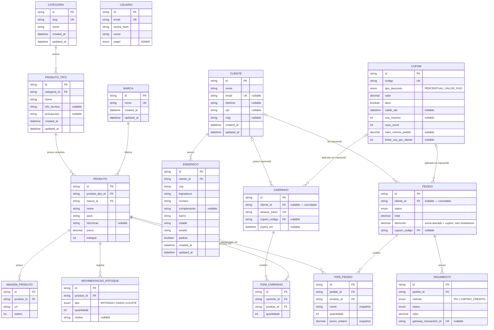

# ERD — Atlas Nova Clean

Diagrama gerado a partir de `schema.prisma`. Atualize este arquivo (e
`schema.dbml`) junto de qualquer mudança de schema — nenhum dos dois é gerado
automaticamente no build.

Pra visualizar no [dbdiagram.io](https://dbdiagram.io): cole o conteúdo de
[`schema.dbml`](schema.dbml) lá. O Mermaid abaixo é a versão que renderiza
direto no repo/GitHub.

> O Mermaid abaixo cobre só o fluxo principal (catálogo → carrinho → pedido →
> pagamento) pra não virar um diagrama ilegível. Tabelas mais novas/auxiliares
> (`RegraAtacado`, `CupomCategoria`/`CupomProduto`/`CupomUsoCliente`, `Banner`,
> `PedidoStatusHistorico`, `PedidoNumeroSequencial`, `TokenRecuperacaoSenha`,
> `RefreshToken`, `EmailEnviado`, `Resenha`) não estão desenhadas aqui — o
> `schema.dbml`/`schema.prisma` são a fonte completa.

## Decisões que valem registrar

- **`Usuario` não tem relação com nenhuma outra tabela ainda.** É só a conta de
  login pro futuro painel administrativo (`papel` hoje só tem `ADMIN`, de
  propósito — expande quando a carta de Auth tiver requisito real). Não é a
  mesma coisa que `Cliente`: `Cliente` é o perfil de quem compra (sem senha,
  criado até em pedido de convidado); `Usuario` é quem faz login.
- **`Pedido.cupomCodigo`/`Carrinho.cupomCodigo` são FK de verdade pra
  `Cupom.codigo`** (não um snapshot solto — isso mudou desde a modelagem
  original; ver nota antiga abaixo do porquê era diferente). `onDelete: SetNull`
  em `Pedido` e comportamento padrão (bloqueia delete) em `Carrinho` — ou seja,
  **não dá pra apagar um `Cupom` que já foi usado em algum carrinho ativo**,
  só desativá-lo (`ativo = false`). Igual `RegraAtacado`, isso é modelagem de
  desconto (referência viva), diferente do snapshot de preço em `ItemPedido`
  (que existe pra nota fiscal/histórico não mudar se o produto mudar depois).
  A FK aponta pro `codigo` (chave de negócio), não pelo `id`, porque é assim
  que o cliente/admin se referem ao cupom — o endpoint de edição
  (`AtualizarCupomUseCase`) bloqueia editar `codigo` de propósito, exatamente
  pra essa FK nunca precisar mudar de valor debaixo de um pedido já criado.
- **`Endereco` existe mas `Pedido` não aponta pra ele ainda.** Como o pedido
  guarda endereço de entrega (snapshot? FK? os dois?) é decisão de fluxo de
  checkout que fica pra carta "Clientes, endereços e cálculo de frete".
- **`ProdutoTipo.info_tecnica`/`precaucoes`** são só o texto padrão por tipo —
  o catálogo do frontend também prevê uma sobreposição por variante
  individual (`ProductVariant.info`/`precautions`), mas nenhum produto real
  usa isso hoje, então não tem coluna equivalente em `Produto`.
- **`Carrinho`/`ItemCarrinho` não têm snapshot de preço** (ao contrário de
  `ItemPedido`) — de propósito. Um carrinho é uma referência viva ao catálogo
  atual; o preço cobrado de verdade é sempre recalculado no servidor
  (`MontarCarrinhoUseCase`) na hora da compra, nunca confiando no que está
  salvo no carrinho. `Carrinho` é identificado por `session_token` (guardado
  no cliente — cookie/localStorage), com `cliente_id` opcional pra quando o
  comprador for conhecido — não depende de login existir.
- **`MovimentacaoEstoque` é só o ledger (tabela), sem nenhuma escrita
  automática ainda.** `decrementarEstoque` continua sendo a única coisa que
  de fato altera `Produto.estoque`; popular esse histórico a cada
  entrada/saída é trabalho de aplicação de uma carta futura.
- **Migration `20260915120000_organizacao_indices_cascade_timestamps`** —
  lote de organização sem mudança de comportamento: índice em `tokenHash`
  (`RefreshToken`/`TokenRecuperacaoSenha`, evita scan sequencial no
  login/refresh), `ItemCarrinho → Carrinho` virou `ON DELETE CASCADE` (antes
  `LimpezaCarrinhosScheduler` tinha que apagar os itens manualmente numa
  transação pra não violar a FK), índice composto `(status, createdAt)` em
  `Pedido` pra suportar o filtro do painel admin, CHECK constraint garantindo
  o XOR `produtoId`/`categoriaId` em `RegraAtacado`, e `createdAt`/`updatedAt`
  em `Categoria`/`Marca`/`ProdutoTipo`/`Endereco` (e `updatedAt` em `Cliente`),
  que não tinham nenhum timestamp — inconsistente com o resto do schema.
