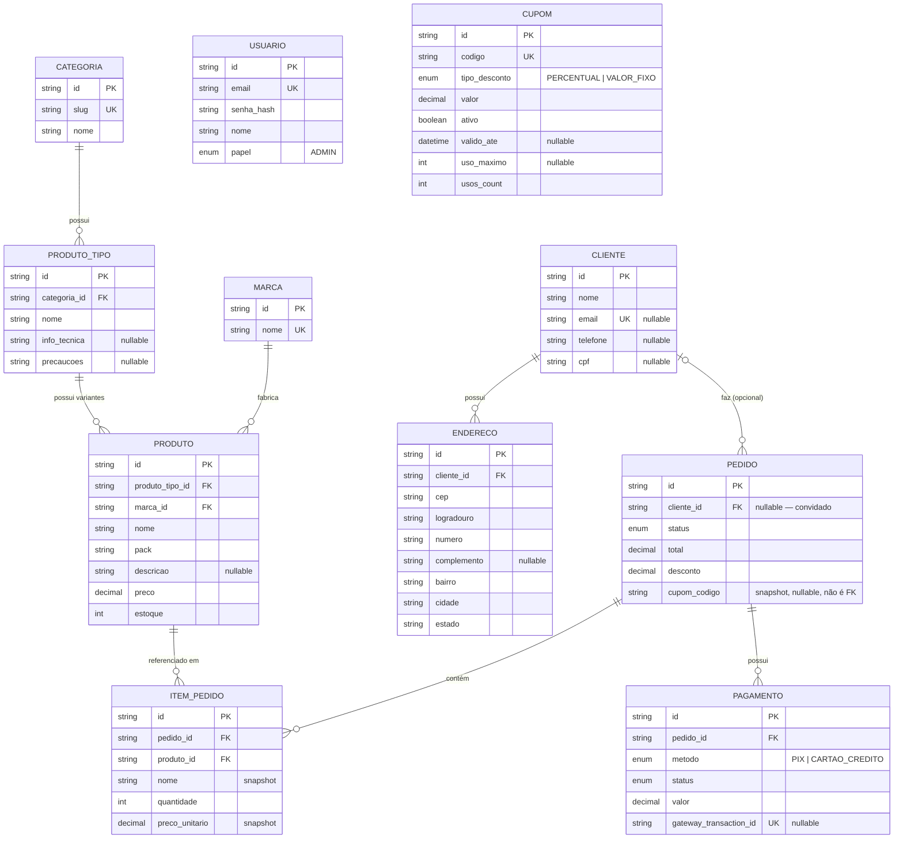

# ERD — Atlas Nova Clean

Diagrama gerado a partir de `schema.prisma`. Atualize este arquivo junto de
qualquer mudança de schema — ele não é gerado automaticamente.

## Decisões que valem registrar

- **`Usuario` não tem relação com nenhuma outra tabela ainda.** É só a conta de
  login pro futuro painel administrativo (`papel` hoje só tem `ADMIN`, de
  propósito — expande quando a carta de Auth tiver requisito real). Não é a
  mesma coisa que `Cliente`: `Cliente` é o perfil de quem compra (sem senha,
  criado até em pedido de convidado); `Usuario` é quem faz login.
- **`Cupom` não tem FK saindo de `Pedido`.** `Pedido.cupomCodigo` é um
  snapshot (texto solto), igual `ItemPedido.nome`/`ItemPedido.precoUnitario` —
  se o cupom for editado ou apagado depois, o pedido já feito não muda. Por
  isso não existe seta `CUPOM ||--o{ PEDIDO` no diagrama, apesar de parecer
  que devia.
- **`Endereco` existe mas `Pedido` não aponta pra ele ainda.** Como o pedido
  guarda endereço de entrega (snapshot? FK? os dois?) é decisão de fluxo de
  checkout que fica pra carta "Clientes, endereços e cálculo de frete".
- **`ProdutoTipo.info_tecnica`/`precaucoes`** são só o texto padrão por tipo —
  o catálogo do frontend também prevê uma sobreposição por variante
  individual (`ProductVariant.info`/`precautions`), mas nenhum produto real
  usa isso hoje, então não tem coluna equivalente em `Produto`.
